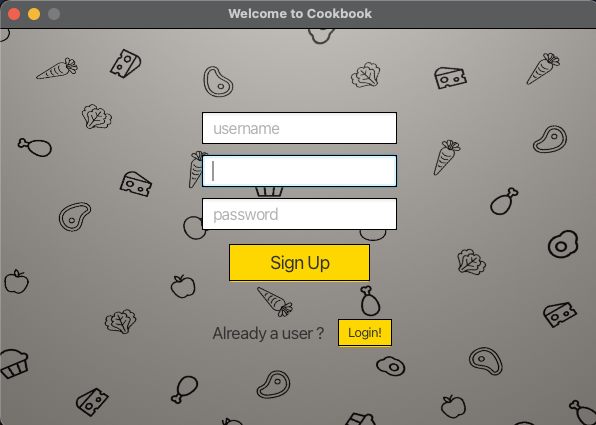
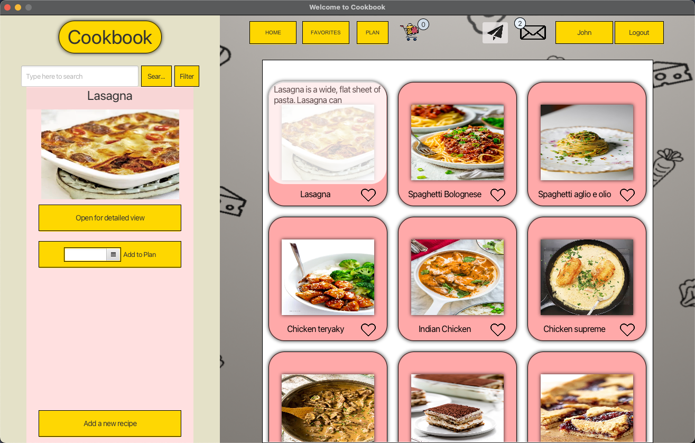
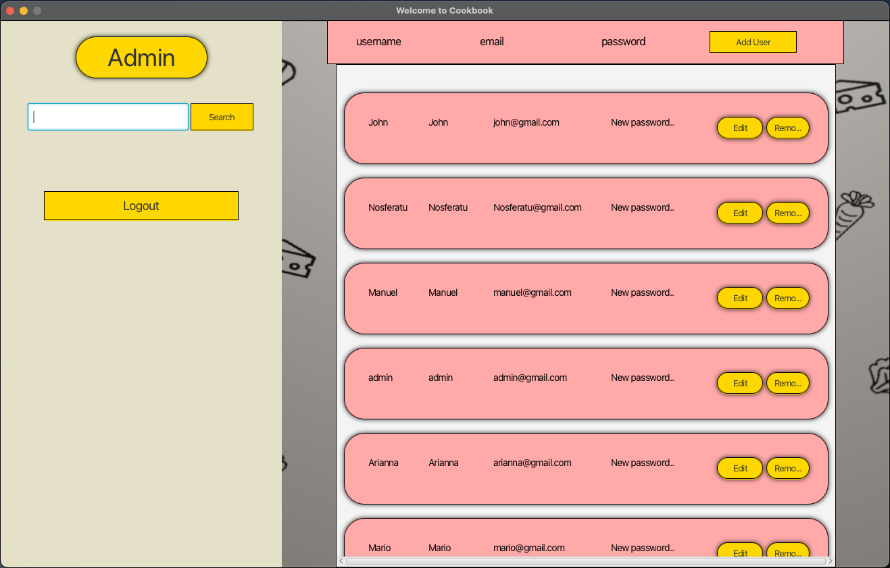
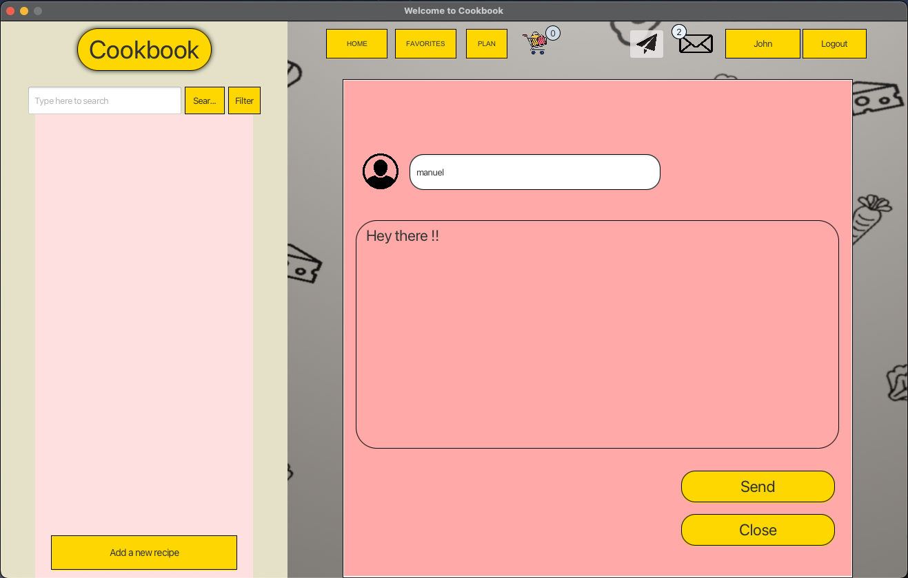
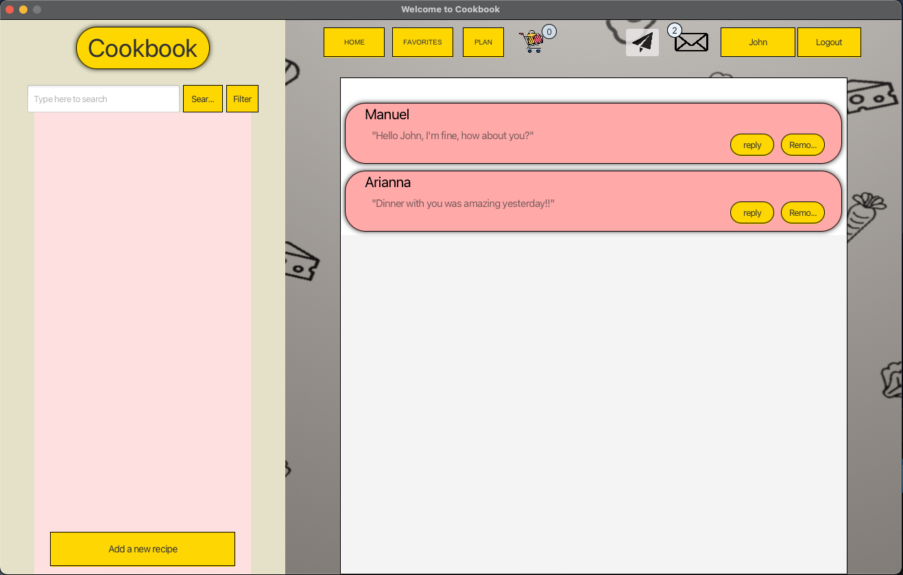
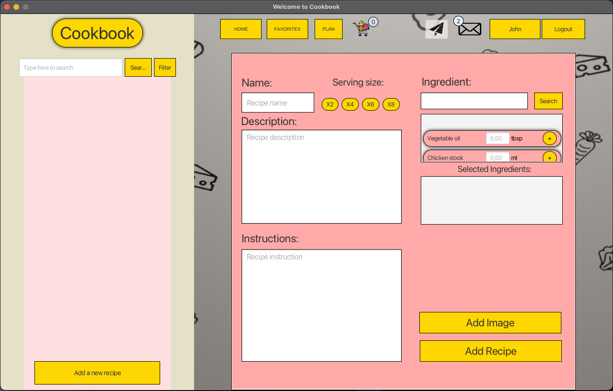

# Cookbook App

This is a small school project application that uses MySQL and the local server environment to connect to the database. Therefore, in order to run it, you need to install MySQL, unless you already have it. The next step is to set the MySQL port number to "3306," username to "root," and password to "root1234." This is done because the credentials are hardcoded in the app (which is a bad practice, I know, but for this app, it's okay).

## Quick Start
```shell 
git clone https://github.com/Wiz1101/Cookbook.git
```

```shell 
run `java Cookbook/src/main/java/main/Main.java`
```


<!-- **Some pics From the App** -->
<p align="left">
  
</p>


## Sign-Up 
First thing you have to do is to sign up which takes you on home page.



## Home 
Once user is successfuly created you can login.



## Admin 
It also has admin page from where you can manipulate users (Default credentials: admin, Admin123)



## Message 
The user can send and receive messages 





## New recipe 
Finally The user can add new recipes




**THE END!**

